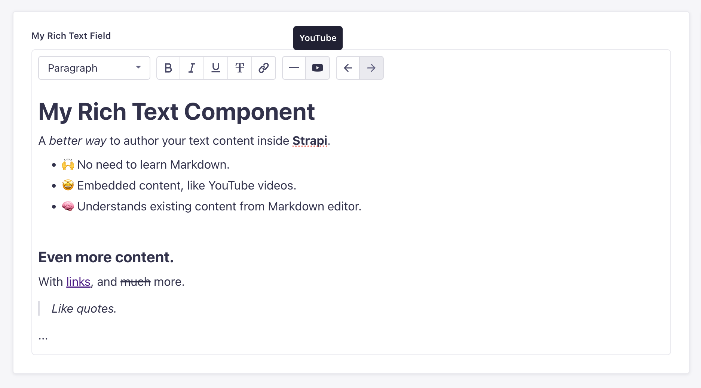

# 🛹 Strapi Plugin Rich Text

#### A WYSIWYG editor for your rich text fields

This Strapi plugin replaces the Markdown editor with a visual, easy-to-use text editor.

- 🧑‍🎓 Write content without needing to know Markdown syntax.
- 💅 Edit content visually, as in GoogleDocs or Notion.
- 🧱 Add rich content elements, such as embedded YouTube videos.
- 📦 Have your existing Markdown content automatically migrated.

The plugin stores the content in HTML format. When querying content on the frontend, you can simply render the received HTML string.

---



---

## Getting Started

#### Install

```bash
pnpm install strapi-plugin-rich-text

# Rebuild your Strapi admin panel
pnpm run build
```

After this, the `Rich Text` plugin should show up in your list of Plugins in the admin panel.

#### Configuration

| What                 | How                                                                                                                                                                                                                           |
| -------------------- | ----------------------------------------------------------------------------------------------------------------------------------------------------------------------------------------------------------------------------- |
| Allow YouTube Embeds | If you want to embed videos from YouTube, make sure you update your `strapi::security` middleware (see [here](https://github.com/konstantinmuenster/strapi-plugin-rich-text/blob/main/apps/strapi/config/middlewares.ts#L9)). |

---

## About

<a href="https://www.buymeacoffee.com/kmuenster" target="_blank"></a>

Konstantin Münster – [konstantin.digital](https://konstantin.digital)

Distributed under the [MIT](http://showalicense.com/?fullname=Konstantin+M%C3%BCnster&year=2019#license-mit) license.
See `LICENSE` for more information.

[https://github.com/konstantinmuenster](https://github.com/konstantinmuenster)
